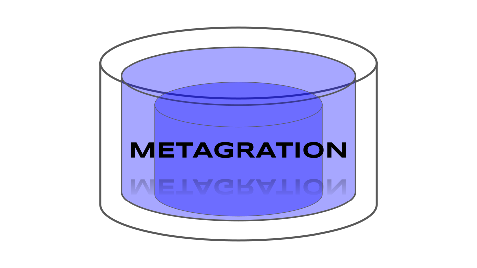

 

  

# Metagration: PostgreSQL Migrator in PostgreSQL

Metagration is a PostgreSQL migration tool written in PostgreSQL.

Metagration "up/down" scripts are stored and applied in-database by
the database.  Creating and managing metagrations and actually running
them are *completely decoupled*.  Metagrations are managed like any
other data in your database using whatever favorite tool you are
already familar with. Metagration has support for 100% of PostgreSQL's
features, because it *is* PostgreSQL.

  - Up/Down scripts are stored procedures in any pl language.

  - No external tools, any PostgreSQL client can manage metagrations.

  - Cloud-friendly single ~400 line SQL file for any PostgreSQL > 10.

  - One simple function for new SQL scripts.

  - Procedures are transactional, and transaction aware.

  - Generates Point In Time Recovery restore points before migration.

  - Metagrations can export/import to/from SQL files.

  - Metagrations are just rows so `pg_dump/pg_restore` them.

  - Can use pgTAP for powerful migration verification.

  - Postgres docker container entrypoint friendly.

## How does it work?

Metagration scripts are stored procedures run *in revision order*.
This means that revision 2 is always run after 1, and before 3 when
migrating forward, and the opposite when going backwards.  It is not
possible to insert "in between" two existing revisions, even if their
revisions are not consecutive.  A `BEFORE INSERT` trigger enforces
that new scripts must have a `revision > max(revision)` for all
existing scripts.  While you can disable this trigger to bulk import
revisions you will be responsible for their revision order being
correct.

When a script is created with `metagration.new_script()` the up and down
code are substituted into the body dynamically generated plpgsql
procedure.  You don't have to use `new_script()`, a script can be written
in any supported language that can write stored procedures, such as
python and javascript.

One and only one script at a time can be `is_current = true`.  This is
enforced with a `UNIQUE` partial index.  The procedure
`metagration.run()` also does a 'LOCK ... SHARE MODE' on the script
table when it runs ensuring only one metagration script can run at a
time.

## Intro

Metagrations are DDL change scripts wrapped in PostgreSQL stored
procedures run in a specific order either "up" or "down".  A
metagration is a script defined entirely within the database, there is
no external migration tool or language.

The process in the forward direction is that you add your metagration
scripts, then you run `metagration.run()` from any database client.
Now your database is up to date.

Metagration scripts are what move the database from one revision to
the next.  Forward metagration runs the "up" script, and backward
metagration runs the "down" script to undo the "up" operation.
Scripts can be written in *any* supported stored procedure language.
Metagration strictly enforces the revision order of the scripts
applied.

Metagration comes with a simple create function for writing fast up
and down scripts in plpgsql, which often look exactly like their SQL
counterparts:

    # SELECT metagration.new_script(
          'create table public.foo (id bigserial)',
          'drop table public.foo'
          );
     new_script
    --------
          1

This creates a new revision `1`.  The function
`metagration.new_script(up[, down])` expands the up and down code into
dynamically created plpgsql functions.  Once the script is created, it
can then be run with `metagration.run()`

    # CALL metagration.run();
    CALL
    # \dt
            List of relations
     Schema | Name | Type  |  Owner
    --------+------+-------+----------
     public | foo  | table | postgres

Now add another script with an unfortunate table name to be reverted:

    # SELECT metagration.new_script(
        'create table public.bad (id bigserial)',
        'drop table public.bad
        );
     new_script
    --------
          2
    # CALL metagration.run();
    CALL
    # \dt
            List of relations
     Schema | Name | Type  |  Owner
    --------+------+-------+----------
     public | foo  | table | postgres
     public | bad  | table | postgres

Now revision `2` can be reverted by calling `metagration.run()` with a
specific target revision, in this case back to 1, and the `bad` table
gets dropped:

    postgres=# CALL metagration.run(1);
    CALL

    # \dt
            List of relations
     Schema | Name | Type  |  Owner
    --------+------+-------+----------
     public | foo  | table | postgres

The current, previous, and next revisions can be queried:

    # SELECT metagration.previous_revision();
     previous_revision
    ------------------
                     0

    # SELECT metagration.current_revision();
     current_revision
    -----------------
                    1

    # SELECT metagration.next_revision();
     next_revision
    --------------
                 2

Metagrations can also be run with a relative revision parameter passed
as a text string:

    CALL metagration.run('1');  -- go forward one revision
    CALL metagration.run('-3');  -- go back three revisions

A log of all migrations, their start and end revisions, times, and
restore points are stored in the `metagration.log` table:

    # SELECT * FROM metagration.log ORDER BY migration_start;
     revision_start | revision_end |        migration_start        |         migration_end         | txid |           restore_point           | restore_point_lsn
    ----------------+--------------+-------------------------------+-------------------------------+------+-----------------------------------+-------------------
                  0 |            1 | 2020-05-13 23:13:02.830335+00 | 2020-05-13 23:13:02.831964+00 |  505 | 0|1|2020-05-13|23:13:02.830335+00 | 0/183F408
                  1 |            3 | 2020-05-13 23:13:02.841926+00 | 2020-05-13 23:13:02.8432+00   |  505 | 1|3|2020-05-13|23:13:02.841926+00 | 0/1841A20
                  3 |            4 | 2020-05-13 23:13:02.846628+00 | 2020-05-13 23:13:02.847429+00 |  505 | 3|4|2020-05-13|23:13:02.846628+00 | 0/1844730
                  4 |            1 | 2020-05-13 23:13:02.848043+00 | 2020-05-13 23:13:02.850642+00 |  505 | 4|1|2020-05-13|23:13:02.848043+00 | 0/18459C0
                  1 |            4 | 2020-05-13 23:13:02.852157+00 | 2020-05-13 23:13:02.858205+00 |  505 | 1|4|2020-05-13|23:13:02.852157+00 | 0/1846790

Before each metagration a recovery restore point is created with
[`pg_create_restore_point`](https://www.postgresql.org/docs/12/functions-admin.html#FUNCTIONS-ADMIN-BACKUP)
and can be used for Point In Time Recovery to the point just before
the migration and other recovery tasks.  The current transaction id is
also saved.

## Docker Entrypoint

Metagrations can be used easily from docker entry points.

## Import and Exporting

The obvious question is, if metagrations are stored procedures that
makes DDL changes, who CREATEs the metagrations?  They can be created
programatically as shown above with `new_script`, or they can be
import and exported using any SQL client or tool.

You can still check your metagrations into source control and stream
them into a new database when you initialize it, then call
`metagrate.run()`.

Because metagrations are in-database, they are dumped and restored
when the database is backed up.

Since this process is *decoupled* from the actual migration, it can be
done using any of the many database management tools for
PostgreSQL. Because metagration scripts are stored procedures, they
are stateless database objects that can be exported, imported, dropped
and re-created as necessary.

A helpful tool for doing this `metagration.export()`.  The `export()`
function will generate SQL script file that `CREATE OR REPLACE`s the
migration scripts. Simply capture the output of this function, for
example with:

    psql -A -t -U postgres -c 'select metagration.export()' > export_file.sql

And then check it in to your source control.  The scripts can then be
imported with
[`psql`](https://www.postgresql.org/docs/12/app-psql.html) or any
other PostgreSQL client:

    psql < export_file.sql

This will import all the migrations but not *run* them, for that you
still call `metagration.run()`.  If `metagration.export(true)` is
called the script will truncate the
script table and re-insert all the exported scripts.
