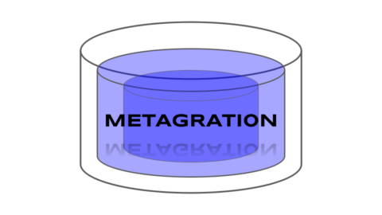

 

  

# Metagration: Logical PostgreSQL Migration

Migrating logically replicated PostgreSQL databases is a delicate
dance of applying the right script at the right time, and enduring
possible downtime making sure replicas are correctly up to date.
Consider the [*warnings from the
documentation*](https://www.postgresql.org/docs/current/logical-replication-restrictions.html):

  - The database schema and DDL commands are not replicated. The
    initial schema can be copied by hand using pg_dump
    --schema-only. Subsequent schema changes would need to be kept in
    sync manually.
    
Metagration is a PostgreSQL migration tool written in PostgreSQL.
Metagration "up/down" scripts are stored procedures and applied
in-database by the database.  Creating and managing metagrations and
actually running them are *completely decoupled*.  

Metagrations can be managed, *and replicated* like any other data in
your database using whatever favorite tool you are already familar
with.  Using tools like
[pglogical](https://github.com/2ndQuadrant/pglogical) you can apply
metagrations across logically replicated cluster at the exact same
point in time in the WAL stream.  Metagration keeps track of [restore
points](https://www.postgresql.org/docs/current/functions-admin.html#FUNCTIONS-ADMIN-BACKUP)
before all changes so entire clusters can be
[Point-In-Time-Recovered]() to the same point in the transcation log,
avoiding migration induced conflict errors.

Metagration has support for 100% of PostgreSQL's features, because it
*is* PostgreSQL:

  - Up/Down scripts are stored procedures in any pl language.

  - No external tools, any PostgreSQL client can manage metagrations.

  - Cloud-friendly single ~400 line SQL file for any PostgreSQL >= 11.

  - One simple function for new SQL scripts.

  - Procedures can be transactional, and transaction aware.

  - Generates Point In Time Recovery restore points before migration.

  - Metagrations can export/import to/from SQL files.

  - Metagrations are just rows so `pg_dump/pg_restore` them.

  - Can use pgTAP for powerful migration verification.

  - Postgres docker container entrypoint friendly.
  
## Intro

Metagrations are DDL change scripts wrapped in PostgreSQL stored
procedures run in a specific order either "up" or "down".  A
metagration is a script defined entirely within the database, there is
no external migration tool or language.

Metagration `script`s are what move the database from one revision to
the next.  Each script has a forward "up" procedure, and optionally a
backward "down" procedure to undo the "up" operation.  Script
procedures can be written in *any* supported stored procedure
language.  Metagration strictly enforces the revision order of the
scripts applied.

Metagration comes with a simple create function for writing fast up
and down scripts in plpgsql, which often look exactly like their SQL
counterparts:

    # SELECT metagration.new_script(
          'CREATE TABLE public.foo (id bigserial)',
          'DROP TABLE public.foo'
          );
     new_script
    --------
          1

This creates a new script with revision `1`.  The function
`metagration.new_script(up[, down])` expands the up and down code into
dynamically created plpgsql functions.  Once the script is created, it
can then be run with `metagration.run()`

    # CALL metagration.run();
    # \dt
            List of relations
     Schema | Name | Type  |  Owner
    --------+------+-------+----------
     public | foo  | table | postgres

Now add another script with an unfortunate table name to be reverted:

    # SELECT metagration.new_script(
        'CREATE TABLE public.bad (id bigserial)',
        'DROP TABLE public.bad
        );
     new_script
    --------
          2
    # CALL metagration.run();
    # \dt
            List of relations
     Schema | Name | Type  |  Owner
    --------+------+-------+----------
     public | foo  | table | postgres
     public | bad  | table | postgres

Now revision `2` can be reverted by calling `metagration.run()` with a
specific target revision, in this case back to 1, and the `bad` table
gets dropped:

    postgres=# CALL metagration.run(1);
    # \dt
            List of relations
     Schema | Name | Type  |  Owner
    --------+------+-------+----------
     public | foo  | table | postgres

The current, previous, and next revisions can be queried:

    # SELECT metagration.previous_revision();
     previous_revision
    ------------------
                     0
    # SELECT metagration.current_revision();
     current_revision
    -----------------
                    1
    # SELECT metagration.next_revision();
     next_revision
    --------------
                 2

Metagrations can also be run with a relative revision parameter passed
as a text string:

    CALL metagration.run('1');  -- go forward one revision
    CALL metagration.run('-3');  -- go back three revisions

A log of all migrations, their start and end revisions, times, and
restore points are stored in the `metagration.log` table:

    # SELECT * FROM metagration.log ORDER BY migration_start;
     revision_start | revision_end |        migration_start        |         migration_end         | txid |           restore_point           | restore_point_lsn
    ----------------+--------------+-------------------------------+-------------------------------+------+-----------------------------------+-------------------
                  0 |            1 | 2020-05-13 23:13:02.830335+00 | 2020-05-13 23:13:02.831964+00 |  505 | 0|1|2020-05-13|23:13:02.830335+00 | 0/183F408
                  1 |            3 | 2020-05-13 23:13:02.841926+00 | 2020-05-13 23:13:02.8432+00   |  505 | 1|3|2020-05-13|23:13:02.841926+00 | 0/1841A20
                  3 |            4 | 2020-05-13 23:13:02.846628+00 | 2020-05-13 23:13:02.847429+00 |  505 | 3|4|2020-05-13|23:13:02.846628+00 | 0/1844730
                  4 |            1 | 2020-05-13 23:13:02.848043+00 | 2020-05-13 23:13:02.850642+00 |  505 | 4|1|2020-05-13|23:13:02.848043+00 | 0/18459C0
                  1 |            4 | 2020-05-13 23:13:02.852157+00 | 2020-05-13 23:13:02.858205+00 |  505 | 1|4|2020-05-13|23:13:02.852157+00 | 0/1846790

Before each metagration a recovery restore point is created with
[`pg_create_restore_point`](https://www.postgresql.org/docs/current/functions-admin.html#FUNCTIONS-ADMIN-BACKUP)
and can be used for Point In Time Recovery to the point just before
the migration and other recovery tasks.  The current transaction id is
also saved.

## Dynamic Metagrations

Metagration scripts are stored procedures, and can be fully dynamic in
terms of the SQL they execute when run.  To facilitate this, the
`run()` function accepts an optional `args jsonb` argument that is
passed to each script when run.  This allows scripts to respond to
dynamic variables at run time.

For plpgsql scripts built with `new_script`, optional local variable
declarations can also be provided, in the following example, the index
variable `i` in the `FOR` loops are declared in the `up_declare` and
`down_declare` parameters to `new_script()` shown here:

    SELECT new_script(
    $up$
        FOR i IN (SELECT * FROM generate_series(1, (args->>'target')::bigint, 1)) LOOP
            EXECUTE format('CREATE TABLE %I (id serial)', 'foo_' || i);
        END LOOP
    $up$,
    $down$
        FOR i IN (SELECT * FROM generate_series(1, (args->>'target')::bigint, 1)) LOOP
            EXECUTE format('DROP TABLE %I', 'foo_' || i);
        END LOOP
    $down$,
        up_declare:='i bigint',
        down_declare:='i bigint'
        );
        
To run, pass an integer value for the `target` jsonb key in `args`:

    # CALL metagration.run(args:=jsonb_build_object('target', 3));
    # \dt+
                          List of relations
     Schema |  Name | Type  |  Owner   |  Size   | Description 
    --------+-------+-------+----------+---------+-------------
     public | foo_1 | table | postgres | 0 bytes | 
     public | foo_2 | table | postgres | 0 bytes | 
     public | foo_3 | table | postgres | 0 bytes | 
     
If your up script depends on `args`, it's likely your down scripts do
too.  Pass them as well to revert or, get the args used in the up
migration from the `migration.log` table where they are saved.

    # CALL metagration.run('-1', args:=jsonb_build_object('target', 3));
    # \dt+
                          List of relations
     Schema |  Name   | Type  |  Owner   |  Size   | Description 
    --------+---------+-------+----------+---------+-------------

    # SELECT migration_args FROM metagration.log 
      WHERE revision_end = metagration.current_revision() 
      ORDER BY migration_end DESC LIMIT 1;
      
     migration_args 
    ----------------
     {"target": 3}
    (1 row)

## Import and Exporting

The obvious question is, if metagrations are stored procedures that
makes DDL changes, who CREATEs the metagrations?  They can be created
programatically as shown above with `new_script` or by inserting
directly into the `metagraiton.script` table. They can be imported and
exported using any PostgreSQL client or admin tool.  Because
metagrations are in-database, they are dumped and restored when the
database is backed up.

You can still check your metagrations into source control and stream
them into a new database when you initialize it, then call
`metagrate.run()`.

Since this process of creating metagrations is *decoupled* from the
actual act of migration, it can be done using any of the many database
management tools for PostgreSQL. Because metagration scripts are
stored procedures, they are stateless database objects that can be
exported, imported, dropped and re-created as necessary.

A helpful tool for doing this `metagration.export()`.  The `export()`
function will generate SQL script file that `CREATE OR REPLACE`s the
migration scripts and optionally clear and run them. Simply capture
the output of this function, for example with:

    psql -A -t -U postgres -c 'select metagration.export()' > export_file.sql

And then check it in to your source control.  The scripts can then be
imported with
[`psql`](https://www.postgresql.org/docs/current/app-psql.html) or any
other PostgreSQL client:

    psql < export_file.sql

This will import all the migrations but not *run* them, for that you
still call `metagration.run()` or pass `run_migrations:=true` as shown
below.

If `metagration.export(replace_scripts:=true)` is called the generated
script will truncate the `script` and `log` tables and re-insert all
the exported scripts.

If `metagration.export(transactional:=true)` the generated script will
wrap itself in `BEGIN/COMMIT`.

If `metagration.export(run_migrations:=true)` the generated script
will run the migrations immediately after inserting them.

## Docker Entrypoint

Metagrations can be used easily from the standard postgres docker
container entry point directory.  The SQL code dumped from
`export(run_migrations:=true)` (see above) can be dropped into the
`/docker-entrypoint-initdb.d/` directory in the container and the
migrations will be inserted and automatically run when the new
container is initialized.

## How does it work?

Metagration scripts are stored procedures run *in revision order*.
This means that revision 2 is always run after 1, and before 3 when
migrating forward, and the opposite when going backwards.  It is not
possible to insert "in between" two existing revisions, even if their
revisions are not consecutive.  A `BEFORE INSERT` trigger enforces
that new scripts must have a `revision > max(revision)` for all
existing scripts.  While you can disable this trigger to bulk import
revisions you will be responsible for their revision order being
correct.

When a script is created with `metagration.new_script()` the up and down
code are substituted into the body dynamically generated plpgsql
procedure.  You don't have to use `new_script()`, a script can be written
in any supported language that can write stored procedures, such as
python and javascript.

One and only one script at a time can be `is_current = true`.  This is
enforced with a `UNIQUE` partial index.  The procedure
`metagration.run()` also does a 'LOCK ... SHARE MODE' on the script
table when it runs ensuring only one metagration script can run at a
time.
